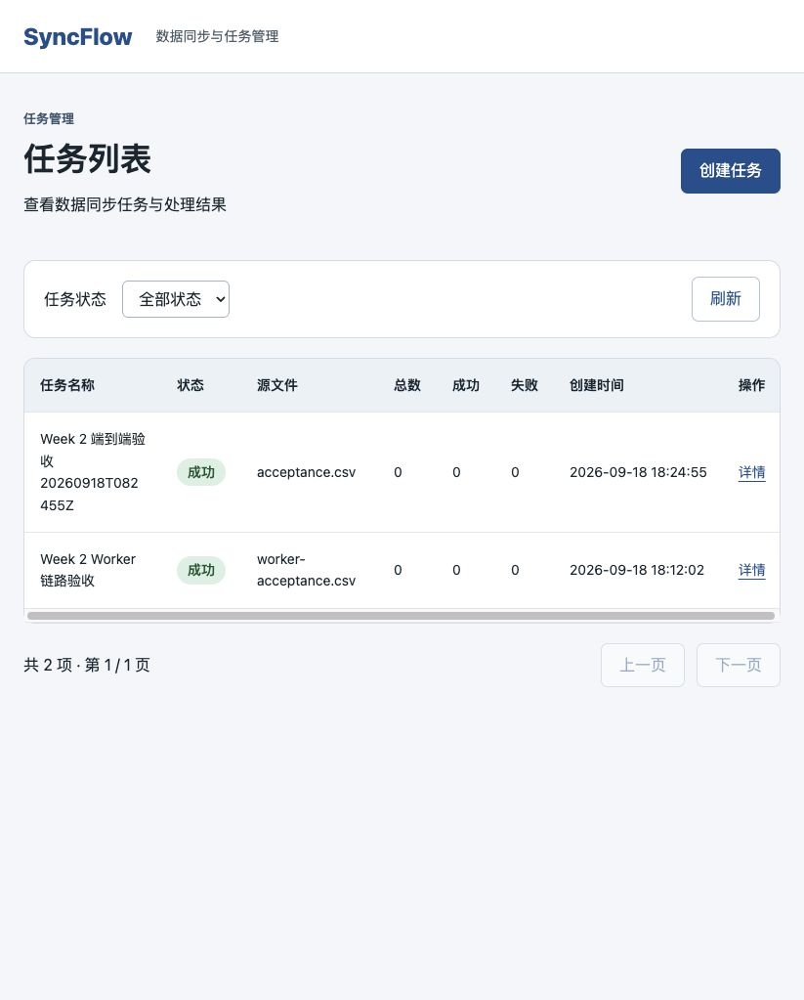
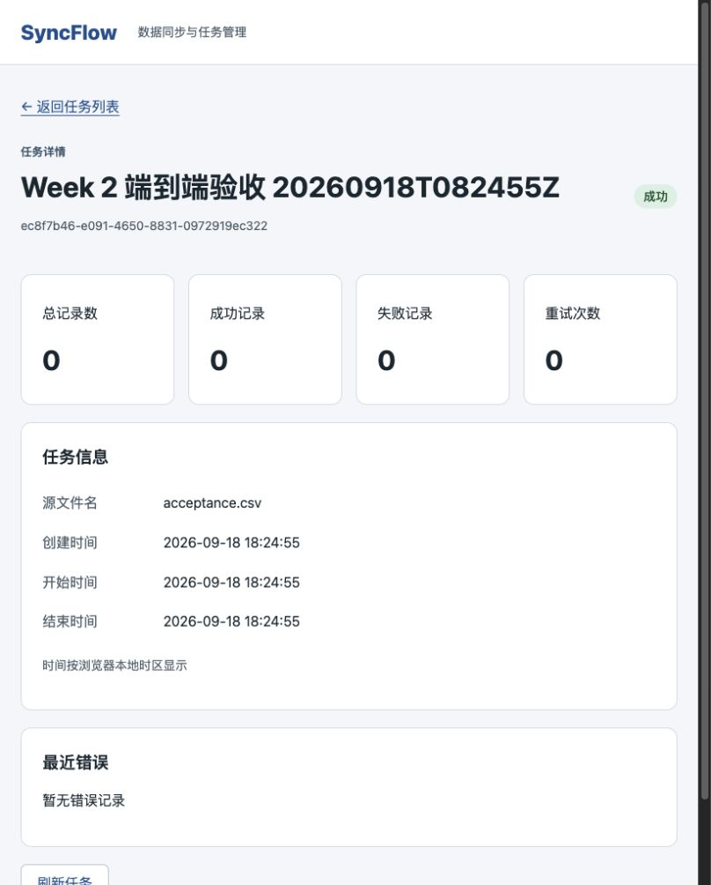
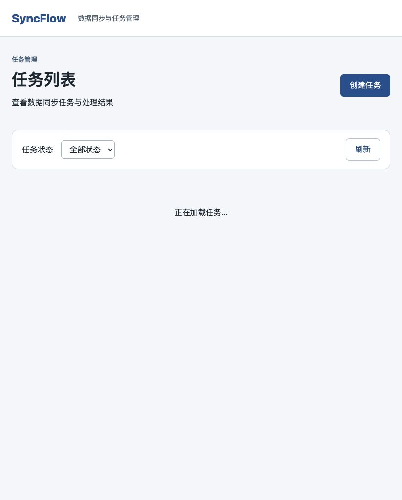
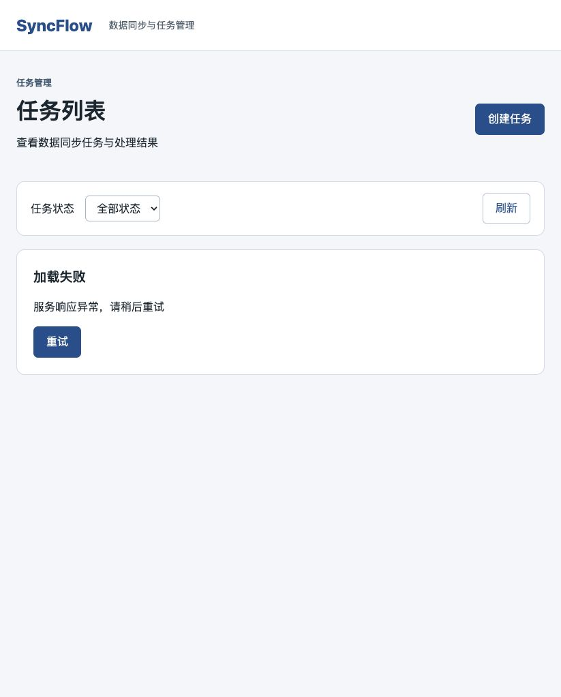
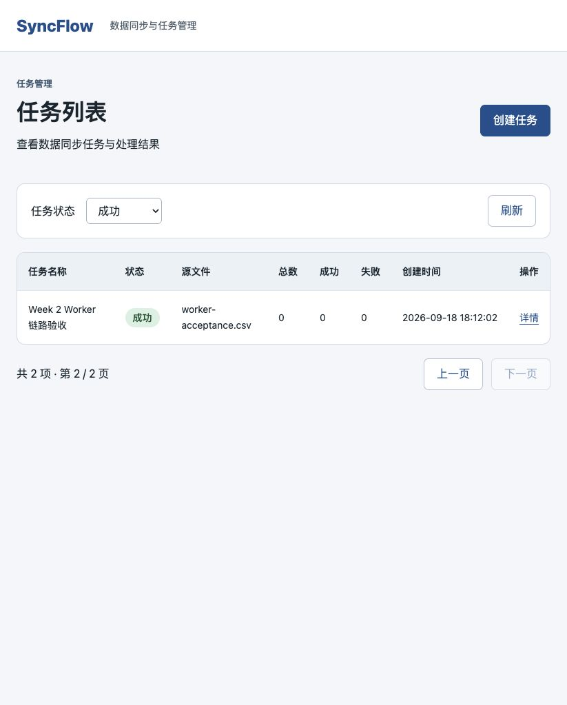
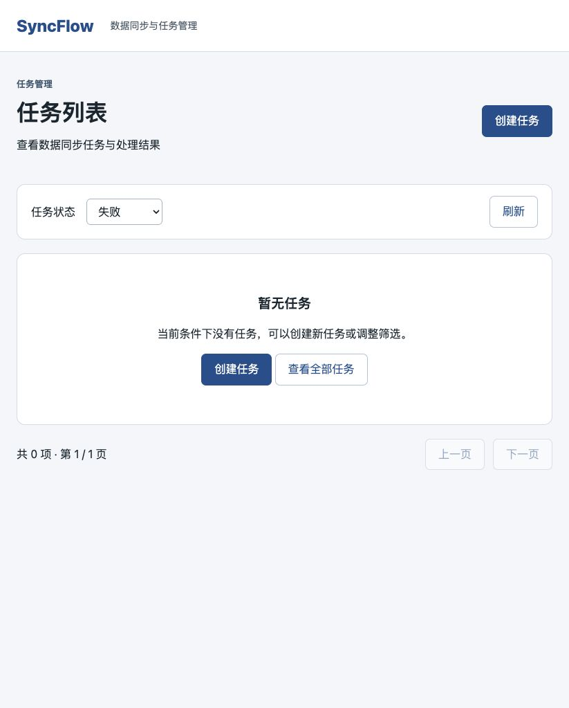
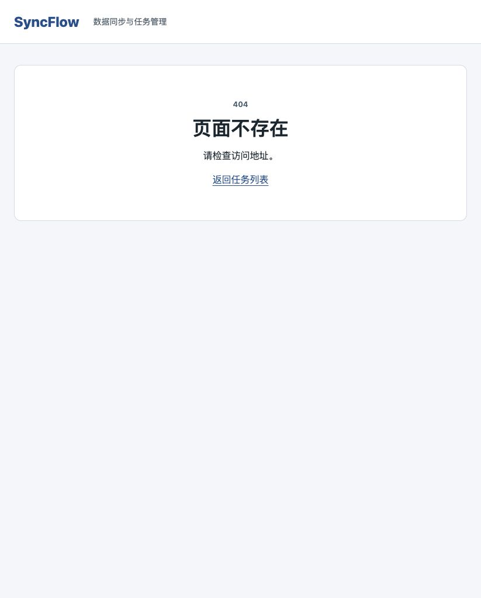

# Week 2 PR 2：React 任务页面与验收交付

分支：`feature/week2-react-job-pages`。基于已合并 PR #5 的 main，关联 Issue #6。后端实现不在本 PR 重复提交。

## 页面功能

- `/` 调用真实 GET /api/v1/jobs，展示名称、中文状态及颜色、文件名、统计、创建时间和详情链接。
- 状态筛选写入 URL 并重置页码；翻页保留筛选，支持浏览器前进/后退。
- `/jobs/:jobId` 展示状态、源文件、统计、重试次数、三个时间与最近错误，缺失任务有明确提示。
- 时间按浏览器本地时区显示为 YYYY-MM-DD HH:mm:ss；空时间显示 —。
- 请求加载、空数据、错误重试及未匹配路由 404；切换请求取消旧响应，避免覆盖新页面状态。
- `/jobs/new` 提供可选名称及 CSV 文件上传，创建成功后进入详情。
- API 客户端与响应类型集中定义；本 PR 不新增前端依赖。

## 本分支验证

2026-09-18 在 PR 2 独立工作目录运行：

- `sh scripts/check.sh`：Ruff、前端格式、3 项前端测试、TypeScript、生产构建、Compose 和 OpenAPI 一致性全部通过。[输出](evidence/week-02-pr2/checks.txt)
- `python3 scripts/acceptance-e2e.py`：通过运行中的本地 Web 代理上传 CSV，返回 201，独立 Worker 最终更新 SUCCESS。[日志](evidence/week-02-pr2/e2e-pr2.log)、[响应](evidence/week-02-pr2/e2e-pr2.json)
- 前端页面内容与此前已实测版本一致；下方截图为 2026-09-18 本地浏览器验收原始证据，包含失败后恢复重试、加载、筛选翻页、空结果和 404。截图对应旧验收任务，新端到端任务以 e2e-pr2.json 为准。
- 后端未修改，不重复统计后端测试；PR #5 的 35 项 / 473 条断言验证记录仍可查看。

## 复现

按 README 安装依赖（建议 Node 24），准备本地 .env，然后执行：

```sh
sh scripts/check.sh
docker compose up -d --build --wait api worker web
python3 scripts/acceptance-e2e.py
```

端到端脚本会在开发库新增带时间戳的验收任务，并保留上传文件；独立后端测试仍运行于隔离数据库。不要将此脚本用于生产环境。

浏览器打开 http://127.0.0.1:5173/ ：

1. 查看列表及详情；切换状态，核对 URL 的 status。
2. 访问 `/?status=SUCCESS&page=1&page_size=1`，点击下一页，确认保留 status 与 page_size。
3. 选择没有数据的状态，确认空提示和创建按钮。
4. 仅在本地开发环境：`docker compose pause api` 后刷新，观察加载；务必执行 `docker compose unpause api` 恢复。
5. `docker compose stop api` 后刷新，等待失败提示；`docker compose start api` 后点击重试，确认列表恢复。
6. 访问 `/not-found` 和不存在的 `/jobs/{id}`，确认 404 与任务不存在的返回入口。

页面流程为浏览器实测，不冒充自动化端到端 UI 测试。3 项自动前端测试验证 URL 参数、本地时间和 API 错误处理。

## 页面截图

### 真实列表及失败后重试恢复



### 详情



### 加载中



### 请求失败



### 筛选分页



### 空数据



### 404



## AI 自查记录

以下为实现者 Codex 自查，不替代独立审阅或人工最终审核。

- 检查筛选重置页码、翻页保留参数与 URL 驱动的状态；自动测试通过。
- 检查请求清理时 AbortController 取消，旧请求不会在页面切换后覆盖结果。
- 检查成功/错误响应集中处理；请求失败显示重试，任务不存在单独提示。
- 检查 React 使用文本渲染名称与错误，无 HTML 拼接；文件大小与扩展名由真实服务端校验。
- 检查时间转换使用浏览器 Date，本地格式固定；空时间有占位。
- 检查分支不包含后端变更、真实 .env、开发库快照或上传文件。证据仅含明确标记的演示任务。
- README 和检查脚本已补齐前端及端到端命令；截图已移入版本控制目录，避免外部审阅者看不到本地 output 文件。

人工最终审核与合并仍待完成。本周 Worker 为模拟处理，记录统计仍为 0；详情可手动刷新，未实现自动轮询。
