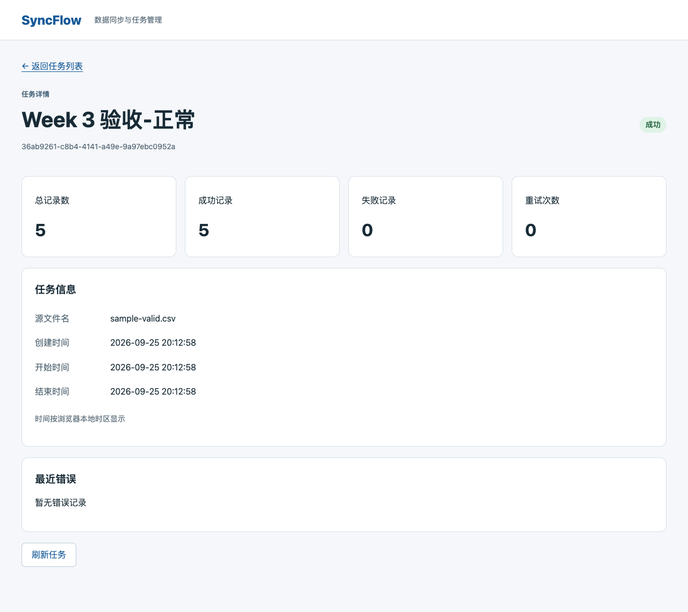
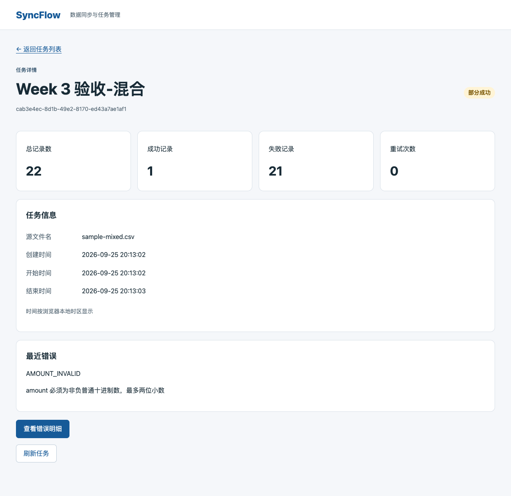
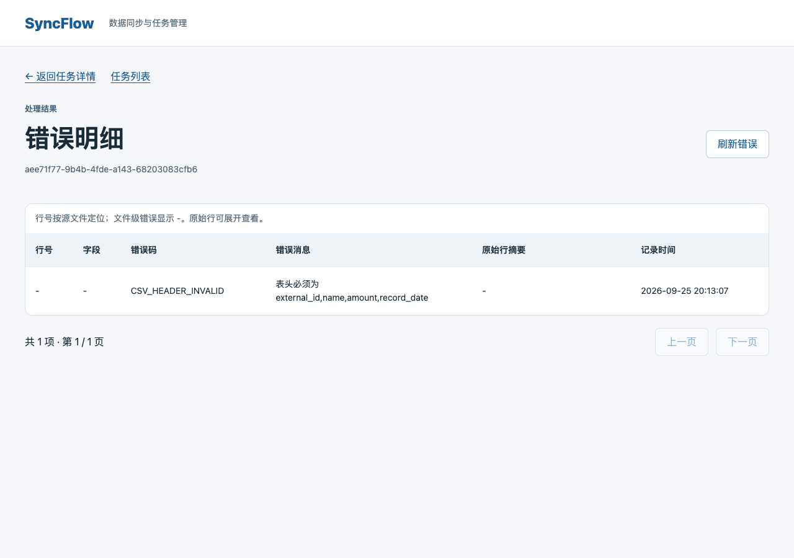

# Week 3 测试与验收报告

验收日期：2026-09-25。对应 [清单第七节](week-03-checklist.md) 的 24 项要求，全部通过。测试使用独立 MySQL 8.4、Redis、HTTP API、Worker 和 Chrome；没有使用开发数据库或开发上传目录。

## 结果

| 检查 | 本次结果 |
| --- | --- |
| 后端完整测试 | **74 / 74 通过**，无失败、异常或跳过；约 39.9 秒 |
| 前端原生测试 | **6 / 6 通过** |
| 浏览器验收 | **9 / 9 组通过**，无未捕获页面异常 |
| 浏览器样例与数据库对账 | **3 / 3 通过** |
| 项目检查 | 后端静态/格式、前端格式/类型/生产构建、Compose、OpenAPI 一致性全部通过 |

后端 74 项由 CSV 14、HTTP 契约 7、创建任务 11、数据库 8、任务与错误查询 15、Worker 18、报告准确性 1 项组成。项目检查额外执行的 14 项 CSV 测试属于这 74 项的子集，未重复计入总数。通过项数量是测试方法数，参数边界还包含多个子用例；未据此推算代码覆盖率。

可随仓库保存的 [结构化结果快照](week-03-test-results.json)包含全部后端用例名称、状态、耗时、九组浏览器结果及三类样例的数据库实际值。完整断言和日志保存在本地 `output/week-03-acceptance/`，见文末。

## 本节补充

1. 固定三类 CSV 样例和机器可读预期；浏览器直接上传仓库文件，断言页面统计、API 统计、错误码与行号。新增只读数据库核对，逐条比较规范化记录以及 API/数据库的全部七个错误字段。
2. 修正测试报告中子用例失败可能未标记父用例失败的问题，并用故意失败/抛异常的内嵌子用例验证报告准确性；这些预期失败不会令外层自检失败。
3. 更新 [测试计划](../design/test-plan.md)，移除当前预期中第一周遗留的 202/422、QUEUED、自动租约恢复等提案口径；保留已知能力边界。

## CSV 与边界覆盖

主要用例：[test_csv_source.py](../../backend/tests/test_csv_source.py)，金额/日期存储另由 [test_database.py](../../backend/tests/test_database.py)验证。

| 清单项 | 验证依据 | 结果 |
| --- | --- | --- |
| UTF-8、BOM、中文、trim | `test_utf8_bom_normalization_and_native_types`，含 CRLF、中文、逗号名称及四字段空白 | 通过 |
| 缺失/不可读取、非 UTF-8、空文件、仅表头 | `test_extension_read_failures_and_invalid_configuration`、`test_empty_and_invalid_encoding`；权限错误注入 `PermissionError`，缺失路径及编码用真实文件 | 通过 |
| 缺失/重复/错序/额外表头、分隔符 | `test_headers_are_exact_and_first`，包含分号分隔 | 通过 |
| 空行、引号逗号和换行、行号 | `test_blank_lines_and_physical_line_numbers`；按记录起始物理行定位，包含表头和空行 | 通过 |
| 文件大小、10,000 行及配置边界 | `test_default_and_configured_byte_limits`、`test_default_and_configured_row_limits_include_invalid_rows`；10 MB/1 MB 等于与多一字节、10,000/10,001 条记录；上传 API 也独立校验 | 通过 |
| 列数、每个必填字段、纯空白 | `test_required_and_column_count`，少列、多列及每个字段的空字符串/Unicode 空白 | 通过 |
| external_id 边界及去重 | `test_external_id_format_and_boundaries`、`test_duplicate_ids_first_valid_wins_and_scope_is_per_file`；1/64/65 字符、非法字符、大小写/trim 后去重 | 通过 |
| name 边界 | `test_name_length_in_characters_and_large_field`；中文按字符计数，128/129 和超长字段 | 通过 |
| 金额格式和 DECIMAL 边界 | `test_decimal_exactness_and_range`、`test_csv_normalized_values_round_trip_in_mysql`；0、整数、一/两位小数、负数、三位小数、指数及非法值；最大 9999999999.99，10000000000 拒绝 | 通过 |
| 日期格式与日历 | `test_date_format_calendar_and_mysql_range`；闰年、非法日期、斜杠/倒序/非补零/时间部分及 MySQL DATE 范围 | 通过 |

## 数据库、Worker 与接口覆盖

主要用例：[test_worker.py](../../backend/tests/test_worker.py)、[test_query_jobs.py](../../backend/tests/test_query_jobs.py)、[test_database.py](../../backend/tests/test_database.py)。

| 清单项 | 验证依据 | 结果 |
| --- | --- | --- |
| 隔离库成功数据与错误分别可查 | 集成测试限制 `mysql-test/syncflow_test`；真实浏览器样例另通过 `verify_browser.py` 对账 | 通过 |
| 行级失败不阻断后续合法行 | `test_all_row_codes_persist_and_later_valid_rows_continue`，覆盖全部行错误码和后续合法行 | 通过 |
| 跨批次去重与唯一约束 | `test_duplicate_across_batches_uses_original_line_error`、`test_record_precision_uppercase_and_uniqueness` | 通过 |
| 单批失败只回滚本批 | `test_middle_batch_unique_violation_rolls_back_only_that_batch`；第 2 批触发真实唯一冲突，501 / 251 / 250，前后批保留、失败行原始数据与原因可查 | 通过 |
| 统计、入库与终态一致 | 249/250/251/500/501 批边界；全合法、全行错误、全系统失败、混合错误；终态事务回滚、提交确认丢失、文件预检失败不写前批 | 通过 |
| 异步创建、独立 Worker、时间 | `test_live_http_api_and_worker_complete_all_terminal_scenarios`：先上传五任务再启动 Worker，均先返回 201/PENDING，随后观察 RUNNING 和各终态，核对开始/结束时间与批进度 | 通过 |
| 错误 API 字段、排序、分页和空值 | `test_errors_*` 七项；105 条分页、空行号优先、同号按内部 ID、任务隔离、无错误空页、缺失任务 404、非法参数 400 | 通过 |

真实 HTTP Worker 场景还通过测试库临时 CHECK 约束触发 MySQL 3819 系统写入失败，并验证下一任务仍可正常处理。故障注入用例与真实数据库约束用例共同覆盖不同失败路径，不把所有测试都描述为无模拟。

## 页面与端到端覆盖

主要脚本：[check-week03-pages.cjs](../../scripts/check-week03-pages.cjs)、[verify_browser.py](../../backend/tests/verify_browser.py)。

| 清单项 | 本次验证 | 结果 |
| --- | --- | --- |
| 上传前校验、信息、禁用、跳转、输入保留 | 后缀和大小校验、名称上限、文件名与字节显示；挂起提交时禁用且只发送一次；失败保留名称/文件并显示后端消息；真实 201 跳详情 | 通过 |
| 3 秒刷新、路由/卸载/终态清理 | 浏览器受控时钟验证 2999 ms 无请求、3000 ms 请求并更新统计；三个终态再推进 12 秒无请求；同组件切换任务和离开详情不再查询旧任务 | 通过 |
| 错误入口、表格、分页及三类状态 | 加载、无错误、失败重试、缺失任务、超出末页；21 条错误两页 20/1，刷新保留页码；源行摘要可展开 | 通过 |
| React 正常上传 | 固定正常样例，页面/API/MySQL 均为 SUCCESS；五条规范化记录逐字段一致 | 通过 |
| React 混合上传 | 固定混合样例，PARTIAL_SUCCESS；21 个金额错误的行号为 3–23，与原始行及数据库一致 | 通过 |
| React 文件级错误 | 固定错误表头样例，FAILED；计数 0/0/0 仍有入口，空行号显示 `-`，原因可查 | 通过 |
| 命令、报告、截图、样例预期与实际 | 本报告、结构化结果、固定样例、完整日志和以下截图 | 通过 |

轮询时序和界面故障反馈使用受控响应；真实三类上传使用完整后端，数据库核对在浏览器结束后、清理测试库之前完成。

## 固定样例的预期与实际

样例与说明见 [samples/README.md](../../samples/README.md)，预期见 [week-03-expected.json](../../samples/week-03-expected.json)。

| 样例 | 预期状态与总/成功/失败 | 实际页面、API、MySQL | 错误记录 |
| --- | --- | --- | --- |
| sample-valid.csv | SUCCESS，5 / 5 / 0 | 一致 | 0 条 |
| sample-mixed.csv | PARTIAL_SUCCESS，22 / 1 / 21 | 一致 | 21 条 AMOUNT_INVALID，物理行 3–23 |
| sample-invalid-header.csv | FAILED，0 / 0 / 0 | 一致 | 1 条 CSV_HEADER_INVALID，行号 null |

正常样例的整数/一位小数规范化为两位金额，引号内逗号名称完整保留；混合样例的 ` s1 `、` 商品 `、`19.9` 实际保存为 `S1`、`商品`、`19.90`。文件级错误不计入失败行数，故错误条数与失败行数可以不同。

正常样例：



混合样例：



文件级错误：



## 复跑命令

前置条件：项目依赖已安装，Docker 可用，已安装 Chrome 和 Playwright。Playwright 若位于共享运行时，通过 `NODE_PATH` 指向包含该包的 `node_modules`；无需向项目新增依赖。本次复用缓存测试镜像并只读挂载当前业务代码。首次无缓存时先执行 `docker compose -f compose.test.yaml build db-tests`。

在仓库根目录执行项目及完整后端检查，保存输出：

```sh
mkdir -p output/week-03-acceptance
sh scripts/check.sh > output/week-03-acceptance/check.log 2>&1
docker compose -f compose.test.yaml up -d --wait mysql-test redis-test
docker compose -f compose.test.yaml run --no-deps --rm \
  -v "$PWD/backend/app:/app/app:ro" db-tests \
  > output/week-03-acceptance/backend.log 2>&1
cp output/db-tests/test-results.json output/week-03-acceptance/backend-results.json
```

随后启动隔离 API；等待 `http://127.0.0.1:18000/healthz` 返回 200，再启动 Worker：

```sh
docker compose -f compose.test.yaml run -d --no-deps --name syncflow-week03-pages-api \
  -p 127.0.0.1:18000:8000 -e UPLOAD_DIR=/tmp/week03-uploads \
  -v "$PWD/backend/app:/app/app:ro" db-tests \
  sh -c 'python -m app.database && exec uvicorn app.main:app --host 0.0.0.0 --port 8000'
docker exec -d syncflow-week03-pages-api python -m app.worker
```

在另一个终端保持隔离前端运行：

```sh
API_PROXY_TARGET=http://127.0.0.1:18000 npm --prefix frontend run dev -- --host 127.0.0.1 --port 15173
```

运行浏览器脚本，再核对数据库。不要与会清空测试表的完整后端测试同时运行：

```sh
REPORT_DIR=output/week-03-acceptance node scripts/check-week03-pages.cjs \
  > output/week-03-acceptance/browser.log 2>&1
docker compose -f compose.test.yaml run --no-deps --rm \
  -v "$PWD/backend/app:/app/app:ro" -v "$PWD/samples:/samples:ro" \
  -v "$PWD/output/week-03-acceptance:/acceptance" db-tests \
  python tests/verify_browser.py /acceptance /samples \
  > output/week-03-acceptance/database-check.log 2>&1
```

验证后停止验收前端并清理隔离服务，失败时也需执行清理：

```sh
docker rm -f syncflow-week03-pages-api
docker compose -f compose.test.yaml down
```

## 证据与范围

- 随仓库保存：[结果快照](week-03-test-results.json)、上述三张截图、样例及测试脚本。
- 本地完整输出（不入库）：[后端报告](../../output/week-03-acceptance/backend-results.json)、[后端日志](../../output/week-03-acceptance/backend.log)、[项目检查](../../output/week-03-acceptance/check.log)、[浏览器报告](../../output/week-03-acceptance/browser-results.json)、[浏览器日志](../../output/week-03-acceptance/browser.log)、[实际 API 场景](../../output/week-03-acceptance/browser-scenarios.json)、[数据库对账](../../output/week-03-acceptance/browser-database.json)、[独立 Worker 场景](../../output/week-03-acceptance/worker-scenarios.json)、[Worker 日志](../../output/week-03-acceptance/worker.log)。

本节完成当前功能验收，不包含 V1.1 重试/取消/崩溃恢复，也不代表性能 SLA、空环境部署复现、PR 审查或 V1.0 发布已完成；这些按后续章节处理。
