# Week 4 功能演示：异步任务、状态刷新与 Worker 控制

本演示采用截图说明，展示 CSV 任务从创建、等待到执行完成，以及取消、并发、超时和停止恢复。页面截图拍摄于 **2026-10-09**；页面时间按浏览器本地时区显示。日志截图来自 **2026-10-08 第六节隔离环境验收**，不是本次手动操作新生成的日志。

阅读顺序：启动 → 创建 → 自动刷新 → 查看结果 → 取消 → 查看并发与恢复证据。图片可点击打开原图；全部截图及原文件名映射见[截图索引](../images/week-04/README.md)。

## 1. 启动与访问

在项目根目录打开终端，启动 Docker Desktop 后执行：

```sh
sh scripts/start.sh
```

脚本构建并启动服务，完成后输出 Web 和 API 文档地址。本次为 `http://127.0.0.1:5173/` 和 `http://127.0.0.1:8000/docs`。

**预期：** 服务可用，任务列表与接口文档正常打开。

**实际：** 启动结果显示 API、Worker、Web 就绪，页面可访问。数据库初始化容器执行完成后退出属于正常行为。

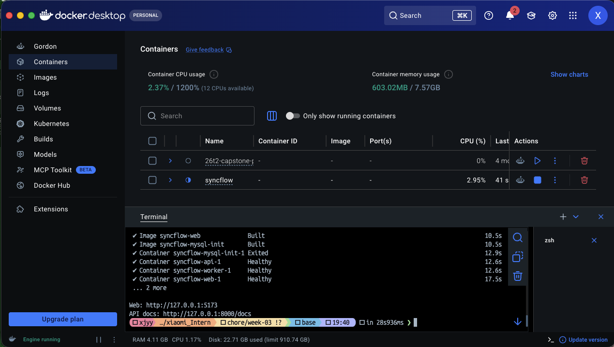

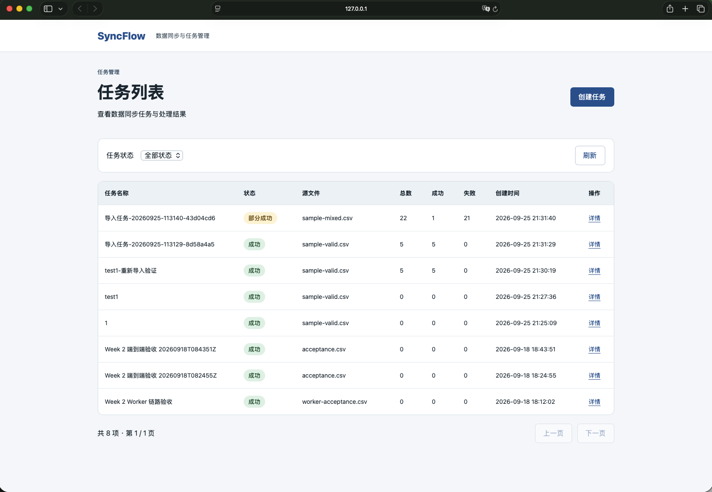

接口文档包含创建、详情、取消和错误查询入口，见[API 文档截图](../images/week-04/03-api-docs.png)。启动前的命令截图见[启动操作](../images/week-04/00-start-command.png)。

## 2. 创建任务与异步执行

### 操作步骤

1. 暂停 Worker：`docker compose stop worker`。
2. 在页面点击“创建任务”，选择 [sample-valid.csv](../../samples/sample-valid.csv)。
3. 输入任务名称 `week04-demo`，点击“上传并创建”。
4. 进入详情页，观察任务状态、统计和开始时间。

**预期：** Worker 暂停时仍能创建任务；创建返回后进入 PENDING，等待后台消费，尚无开始时间。

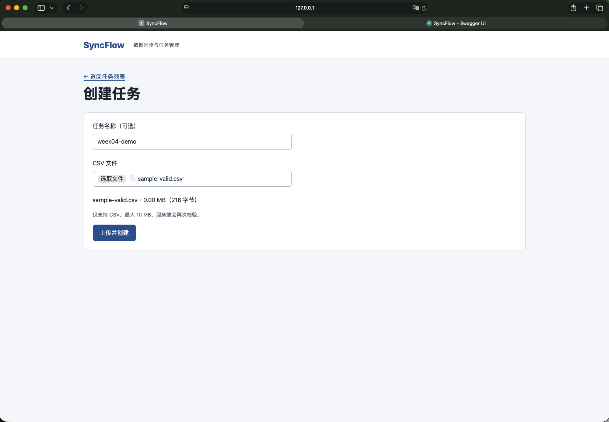

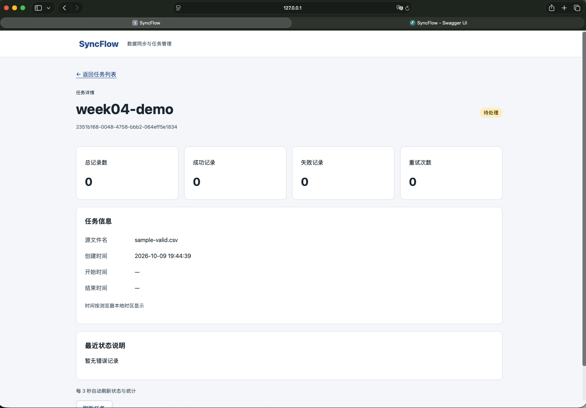

**实际：** 任务 `2351b168-0048-4758-bbb2-064eff5e1834` 于页面时间 `19:44:39` 创建；截图显示“待处理”，开始/结束时间为空，统计尚为 0。后续图 6 展示同一任务的完成结果，形成创建与执行分离的完整记录。文件选择过程另见[选择 CSV](../images/week-04/04-select-csv.png)。

截图没有记录 POST 耗时；“快速返回”的量化证据来自第六节真实 HTTP 验收：Worker 未启动时，5 次创建均返回 `201 / PENDING`，本机耗时 **63.7–69.2 ms**。详见[验收报告](week-04-tests.md)及[结果快照](week-04-test-results.json)。

## 3. 自动刷新、执行完成与终态停止

### 操作步骤

1. 保持上述任务详情页打开，在浏览器开发者工具中选择 Network → Fetch/XHR。
2. Worker 暂停期间观察任务详情请求。
3. 执行 `docker compose start worker`，保持页面打开，等待状态和统计自动更新。
4. 进入成功状态后继续观察，确认不再周期请求任务详情。

**预期：** 非终态每 3 秒刷新；Worker 执行完成后页面显示成功及统计；终态停止轮询。

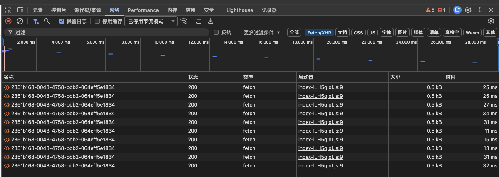

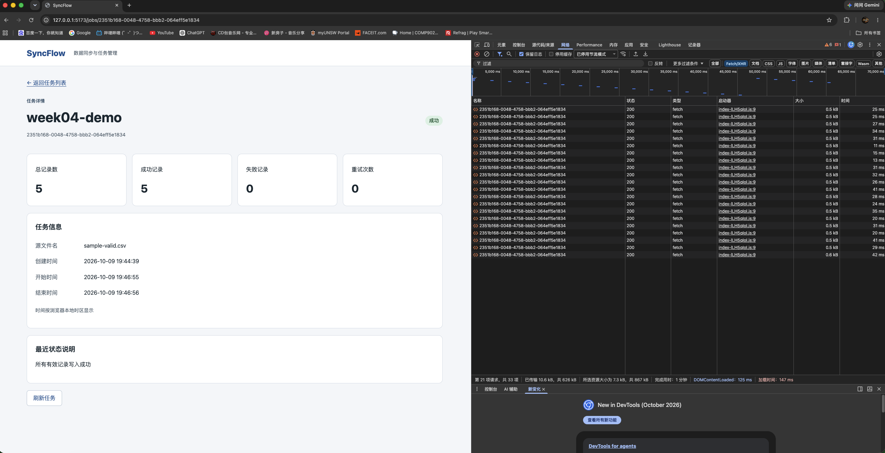

**实际：** 图 5 的时间轴显示周期请求；图 6 中同一任务已变为“成功”，统计为 **5 / 5 / 0**，开始时间 `19:46:55`，结束时间 `19:46:56`。最近状态说明为“所有有效记录写入成功”。

图 6 保留了历史请求，单张截图不能证明随后整个观察区间没有新请求。因此，终态停止另由[第五节轮询验收](week-04-polling.md)与[第六节结果快照](week-04-test-results.json)佐证：四个终态均清除定时器，推进浏览器时钟后请求数不再增加；页面卸载与切换任务也取消旧请求。

## 4. 部分成功与错误说明

### 操作步骤

1. Worker 运行时创建任务，上传 [sample-mixed.csv](../../samples/sample-mixed.csv)。
2. 等待处理完成，查看统计及最近状态说明。
3. 可点击“查看错误明细”继续检查错误行与原始数据。

**预期：** 有效记录写入，错误记录保留原因；最终状态为 PARTIAL_SUCCESS，总数 22、成功 1、失败 21。

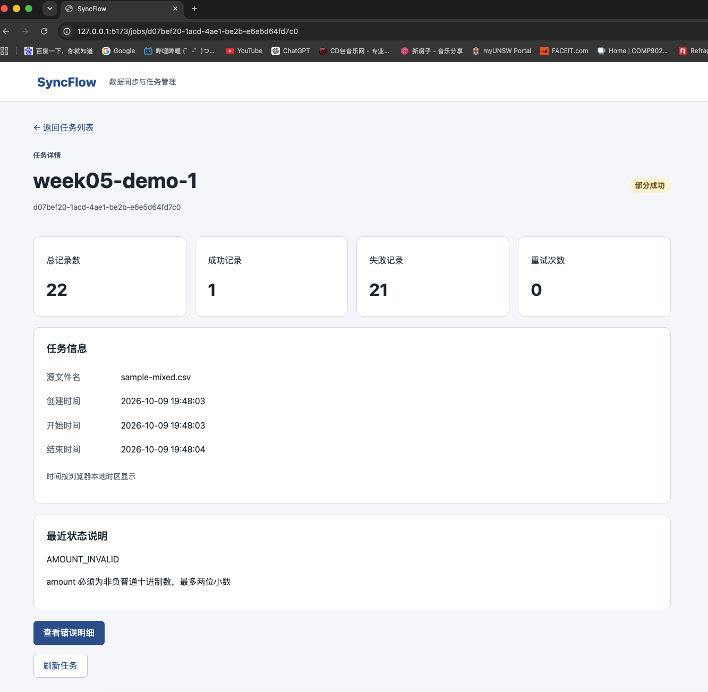

**实际：** 任务 `d07bef20-1acd-4ae1-be2b-e6e5d64fd7c0` 显示“部分成功”，统计 **22 / 1 / 21**；错误码为 `AMOUNT_INVALID`，说明金额必须为非负普通十进制数，最多两位小数。

截图中的任务名称为 `week05-demo-1`，这是本次手动填写的名称；演示内容仍为第四周功能，原图保持不变。本组截图展示详情页及错误入口，错误明细分页与数据库一致性的验证见[第六节报告](week-04-tests.md)。

## 5. 等待中的任务取消

### 操作步骤

1. 执行 `docker compose stop worker`，创建一个待处理任务。本次使用 `sample-mixed.csv`，名称为 `week04-demo-2`。
2. 从详情页复制任务 ID，通过接口取消（将 `JOB_ID` 替换为实际值）：

```sh
curl -X POST 'http://127.0.0.1:8000/api/v1/jobs/JOB_ID/cancel'
```

3. 等待详情页刷新为“已取消”，演示结束后用 `docker compose start worker` 恢复 Worker。

**预期：** 未执行任务由 PENDING 进入 CANCELED，不写入业务记录。

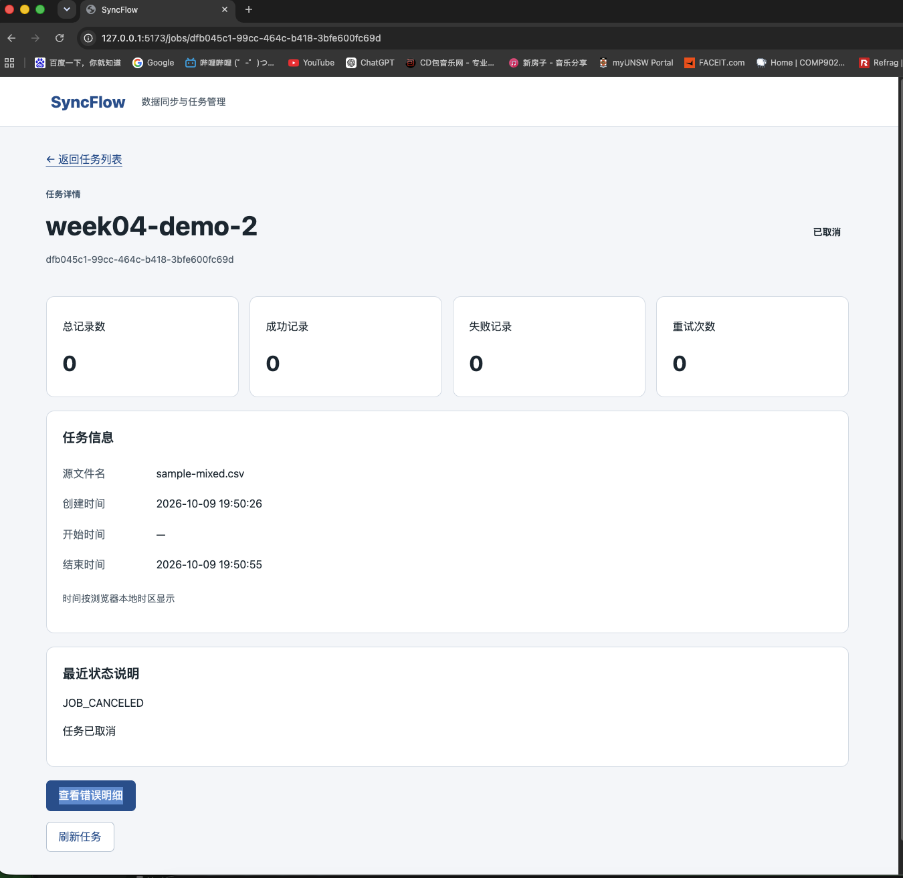

**实际：** 任务 `dfb045c1-99cc-464c-b418-3bfe600fc69d` 于 `19:50:26` 创建、`19:50:55` 结束；状态“已取消”，无开始时间，统计 **0 / 0 / 0**，原因 `JOB_CANCELED`。该图展示等待中取消；运行中取消的证据见下一节。

## 6. 并发、超时与执行中取消

以下采用第六节的自动化测试截图。测试使用独立 MySQL、Redis 和真实 Worker 子进程，通过受控阻塞输入稳定复现边界场景。每项均有对应测试名与 `ok` 结果。

### 6.1 并发限制、重复消息与超时释放

**测试：** `test_concurrency_timeout_releases_slots_and_child_processes`。

**操作：** 并发设为 2，让两个任务阻塞读取，投递第三个普通任务和重复消息，等待任务超时。

**预期与实际：** 两个任务同时执行时第三个保持等待；阻塞任务超时标记 FAILED，槽位释放后普通任务成功；重复消息不造成重复写入，子进程已回收。测试通过。

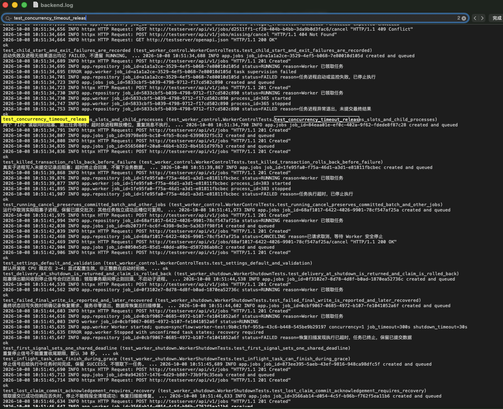

### 6.2 执行中取消与已提交数据保留

**测试：** `test_running_cancel_preserves_committed_batch_and_other_jobs`。

**操作：** 构造已有 250 条提交记录的阻塞任务，运行中调用取消接口，同时处理其他任务。

**预期与实际：** 取消接口返回 CANCELING，Worker 安全停止后进入 CANCELED；保留已提交的 250 条记录，其他任务继续成功，执行槽位可复用。测试通过。

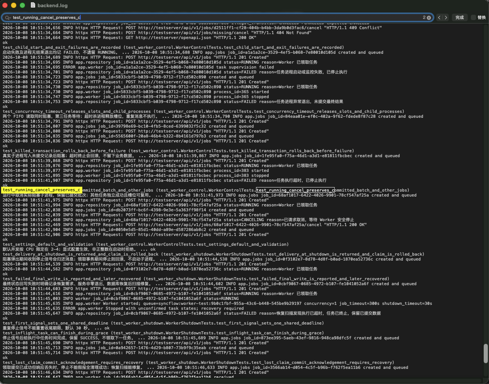

## 7. 优雅停止与重启恢复

### 7.1 停止领取与收尾超时

**测试：** `test_signals_stop_new_work_and_expire_all_inflight_jobs`。

**操作：** 两个任务阻塞执行、另一个等待，分别发送真实 SIGTERM / SIGINT；测试收尾期限设为 1 秒。

**预期与实际：** 不再领取等待任务，执行中的两个任务共用收尾期限；期限到达后停止子进程并标记 FAILED，原因 `WORKER_SHUTDOWN_TIMEOUT`，退出后没有遗留运行中任务。测试通过。1 秒是测试配置，产品默认收尾时间为 30 秒。

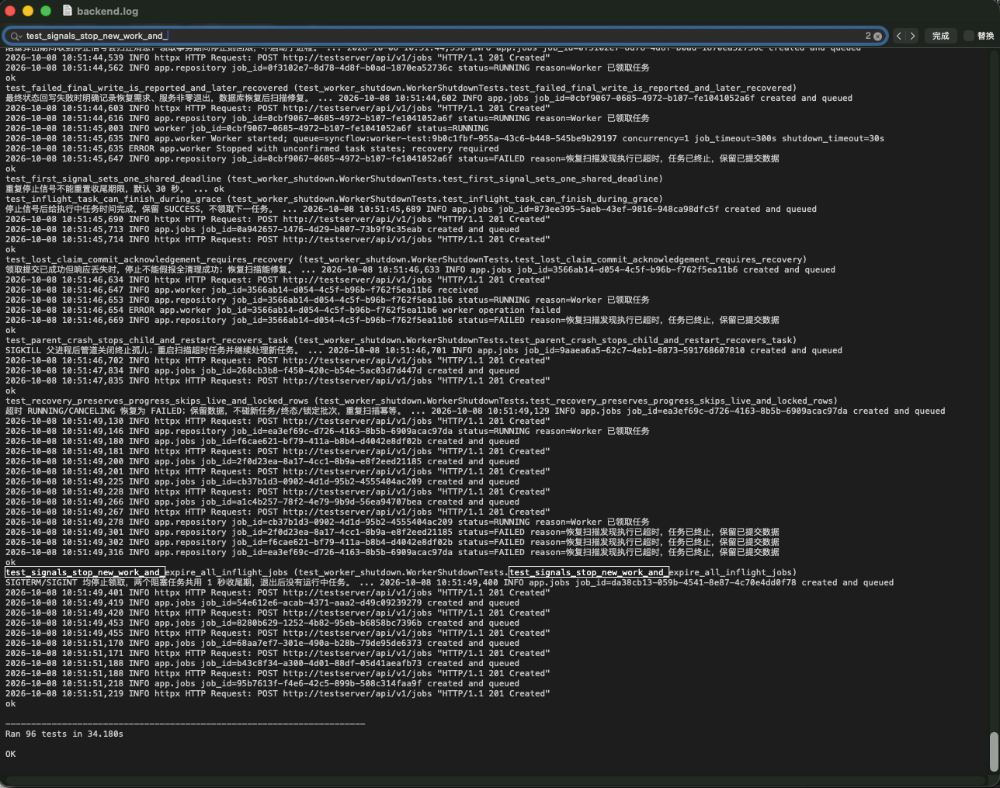

### 7.2 父进程异常退出与恢复扫描

**测试：** `test_parent_crash_stops_child_and_restart_recovers_task`。

**操作：** 对 Worker 父进程发送 SIGKILL，检查子进程退出；模拟任务超时，重启 Worker 执行恢复扫描，再提交普通任务。

**预期与实际：** 父进程异常退出后子进程停止；已过期的执行中任务被扫描标记为失败，后续任务正常处理。测试通过。恢复测试调整任务时间模拟过期；不会把未超时任务立即重放，也不代表已实现第五周的完整自动重试。

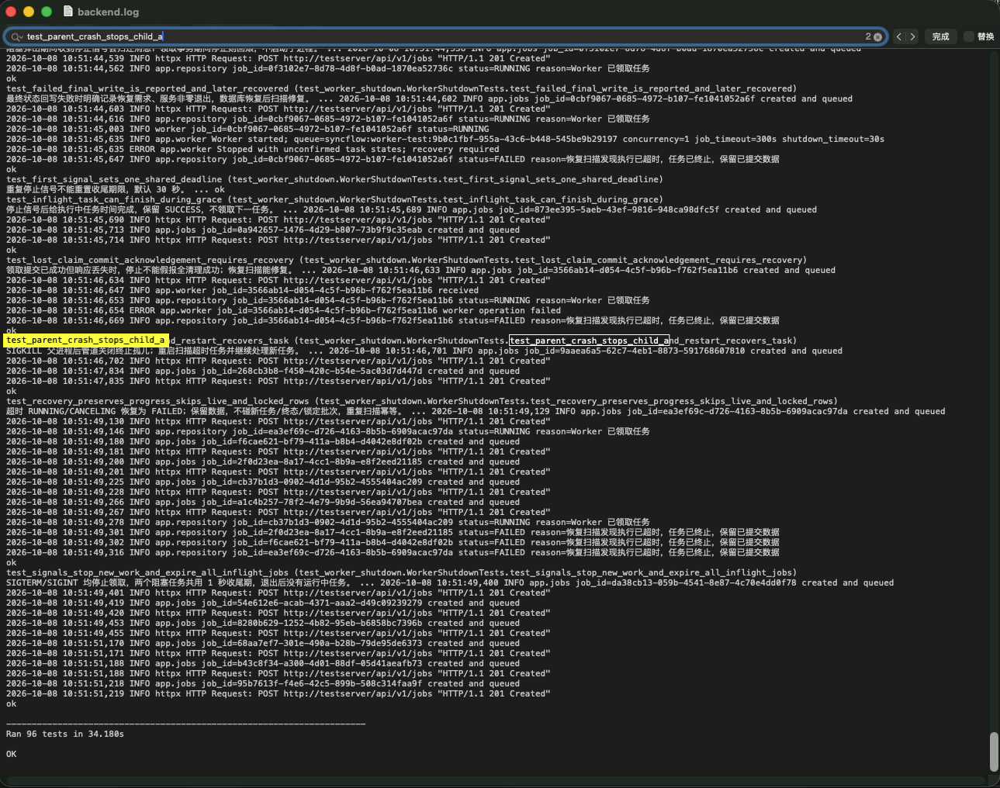

图中同时展示状态回写失败的日志 `Stopped with unconfirmed task states; recovery required`。对应测试确认服务非零退出，并在数据库恢复后通过扫描收敛遗留状态；异常不会静默忽略。参见[异常日志摘录](week-04-failure-evidence.md)。

## 8. 验收与复现入口

| 内容 | 证据入口 |
| --- | --- |
| 本次 15 张原始截图及重命名映射 | [截图索引](../images/week-04/README.md) |
| 完整验收、复跑命令及测试边界 | [第六节验收报告](week-04-tests.md) |
| 96 项后端测试、7 组轮询、9 组页面检查、3 个数据库对账样例 | [结果快照](week-04-test-results.json) |
| 异常原因及任务 ID | [异常日志摘录](week-04-failure-evidence.md) |
| 操作样例与预期数据 | [样例说明](../../samples/README.md) |
| 全周任务进度 | [Week 4 Checklist](week-04-checklist.md) |

本节演示材料已整理到仓库目录，图片与文档采用相对链接，便于提交后在线查看。Git 最终提交与推送状态以 Checklist 第八节为准。
