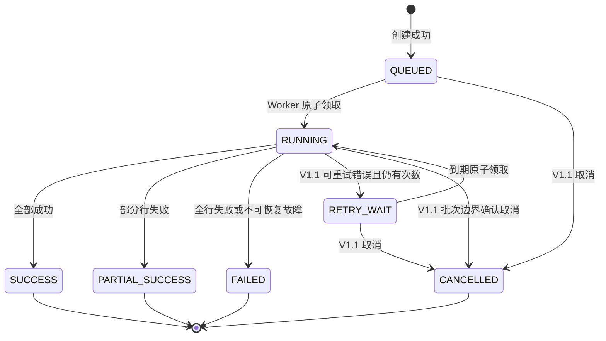

# 任务状态机（设计提案）

状态值同时用于 OpenAPI、MySQL、前端展示和测试。规则依据 PRD 并补充提案，待人工审核；当前未实现业务状态机。

| 状态 | 进入条件与副作用 | 可离开到 |
| --- | --- | --- |
| QUEUED | 文件预检通过、任务事务已提交，计数初始为零 | RUNNING、CANCELLED |
| RUNNING | 条件领取成功，attempt_count 增加，插入执行尝试，设置租约 | SUCCESS、PARTIAL_SUCCESS、FAILED、RETRY_WAIT、CANCELLED |
| SUCCESS | processed_count=total_count 且 failed_count=0 | 无 |
| PARTIAL_SUCCESS | 全部处理结束且 success_count>0、failed_count>0 | 无 |
| FAILED | 全行失败，或文件丢失、超时、重试耗尽等系统错误；可能已有成功数据 | 无 |
| RETRY_WAIT | 可重试错误，attempt_count<MAX_JOB_ATTEMPTS；next_retry_at 已设置 | RUNNING、CANCELLED |
| CANCELLED | QUEUED/RETRY_WAIT 原子取消，或 RUNNING 在批次边界确认取消 | 无 |

创建前空文件或表头错误返回 4xx，不产生 FAILED 任务。total_count 为预检所得非空数据记录数且大于零；processed_count=success_count+failed_count，且不超过 total_count。

RUNNING 的取消请求只设置 cancel_requested=true，返回 202；Worker 在批次事务边界检查，取消与最终完成通过锁定任务行串行化。已到终态再取消返回 409 JOB_NOT_CANCELLABLE；重复取消 CANCELLED 返回 200 原任务。取消保留已提交数据，不算业务回滚。

每个终态设置 finished_at；任务 started_at 保留首次启动时间，attempt 的 started_at/finished_at 记录每次执行。重试不清空成功/错误记录和 checkpoint，避免重放已提交批次。FAILED 不手动原地重开；V1.1 的重试为自动重试，用户修正文件后创建新任务。手动重试按钮不是当前提案范围。

可重试错误提案：数据库连接暂时中断、锁等待或死锁（事务已回滚）、Worker 租约丢失后的恢复。不可重试：文件丢失、文件内容被改变、业务字段错误（记录为行错误）、任务超时。超时按每次 attempt 的启动时间计算 300 秒，重试后重新计时。详细产品语义仍待确认。
