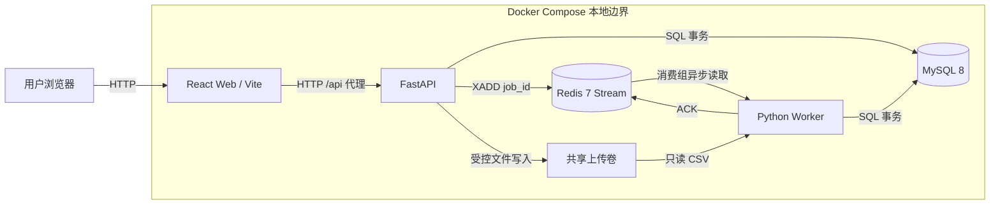
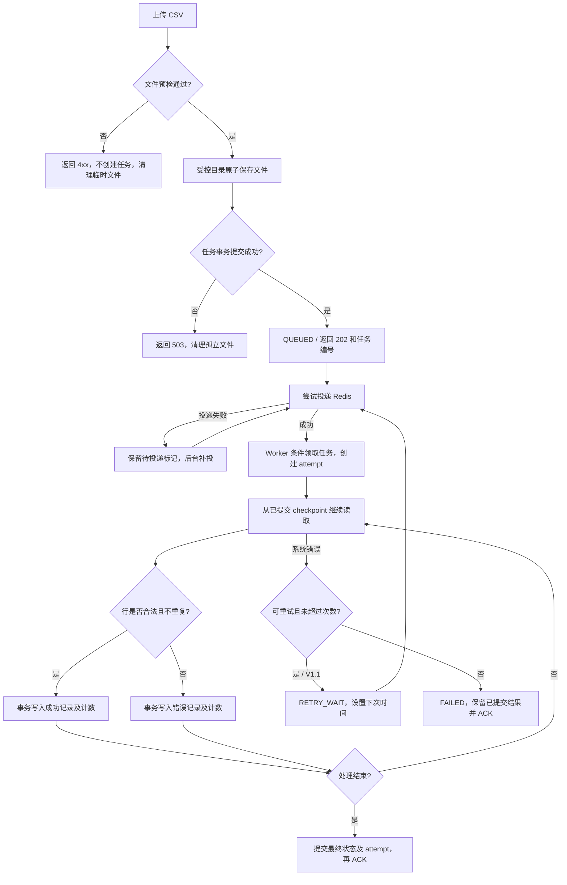

# Week 1 技术设计

本文件及 OpenAPI、数据库、状态机、页面与测试计划是待人工审核的设计提案。当前实现仍为五服务骨架和健康检查。PRD 已明确的约束优先；下列提案不是需求方已确认结论。

## 设计决策与待确认事项

| 编号 | 本次设计采用的提案 | 依据与确认状态 |
| --- | --- | --- |
| D01 | CSV 严格四列表头 external_id,name,amount,record_date，顺序一致；UTF-8，可有 BOM；忽略完全空白记录 | 样例字段已确认，其余待需求方确认 |
| D02 | 四字段必填，不自动 trim；external_id 1–64 字符，name 1–255 字符；业务标识区分大小写 | 为保持唯一性可预测而提出，待确认 |
| D03 | amount 为非负普通十进制，最多两位小数、最大 9999999999.99；拒绝指数、NaN、Infinity 和隐式舍入 | 样例接受 19、1299.5、0.00；范围和精度待确认 |
| D04 | record_date 严格 YYYY-MM-DD 且为有效日期，范围 1000-01-01 至 9999-12-31 | DATE 存储范围与接口一致，业务日期限制待确认 |
| D05 | external_id 作为同任务去重键，第一条合法记录获胜，后续重复行记错；跨任务允许同值 | 候选标识来自样例，去重细则待确认 |
| D06 | 文件级错误在创建任务前拒绝，不产生任务；行级错误由 Worker 记录 | PRD 流程顺序基础上的提案 |
| D07 | 部分行成功则 PARTIAL_SUCCESS；全行失败则 FAILED；系统故障可在保留已提交批次的情况下 FAILED | 完整状态定义见状态机，待确认 |
| D08 | V1.0 实现基本导入及恢复；V1.1 实现配置重试、幂等键、取消、导出及尝试查询 | 执行尝试表和恢复字段先设计；精确版本范围待确认 |

完整疑问与原文依据见 requirements-understanding.md。本提案使设计可评审，不以待确认替代设计，也不擅自声明业务规则已确认。

## 系统边界图

Web 负责交互与展示；API 负责输入边界、持久化任务和查询；Worker 负责文件处理；MySQL 是任务与结果事实来源；Redis 是投递机制。文件内容不放入 Redis。共享上传卷属于后续业务实现所需配置，当前骨架未挂载。

## 核心流程及异常分支

预检采用流式读取两遍：API 第一遍验证文件语法、编码、表头、记录数和大小；Worker 第二遍做字段校验。创建响应不等待业务写入，但预检仍需读取上传文件。最大 10 MB、10000 个非空数据记录；文件级错误包含 CSV 引号损坏和列数错误。row_number 为去除表头后的逻辑 CSV 记录序号（包含空白记录位置），不是物理文本行号；checkpoint 记录已处理的非空记录数。

## 投递、事务与恢复

1. API 将文件以生成的 UUID 名称写入受控目录；仅保留 basename 作为展示名，禁止客户端路径直接用于存储。通过请求流累计字节执行上限校验。
2. MySQL 事务插入 QUEUED 任务，dispatch_pending=true。提交后快速返回 202；后台投递器扫描该标记并写 Redis Stream，再清除标记。无需 Redis 和 MySQL 分布式事务。
3. 标记清除失败可能重复投递。Worker 使用条件更新领取 QUEUED/到期 RETRY_WAIT；检查 attempts 上限，再在同一事务创建 attempt 并设置租约。重复消息不能重复领取 RUNNING 或终态任务。
4. 每批最多 100 行，逐行判定后在同一 MySQL 事务写成功/错误记录，更新 success_count、failed_count、processed_count 和 checkpoint。计数必须满足 processed=success+failed。回滚不推进 checkpoint。
5. 恢复时顺序解析并跳过已提交的非空记录，不重复计数。成功记录的唯一约束作为并发保护；业务重复与消息重投分别处理。SQL 批次发生失败时必须回滚整批，不能仅更新计数。
6. RUNNING 租约持续续期；恢复器处理过期租约时加任务行锁并使旧 attempt 结束。每次批次提交要求 attempt_no 和状态仍匹配，旧 Worker 失去租约后不得再提交（防止并发写入）。
7. 终态与 attempt 结束在同一事务提交，然后 ACK Redis。提交后 ACK 失败可重投，终态检查直接 ACK。系统中断可保留先前已提交批次，API 明确显示失败和已完成数量。
8. V1.0 租约过期可终止为 FAILED；V1.1 根据次数和错误分类进入 RETRY_WAIT。默认最多三次执行，退避使用前两项 5、30 秒，多余配置项 120 秒不使用；若次数需要更多退避项则复用最后一项。此取值规则待确认。

上述恢复器和投递器可由 Worker 内部定时循环承担，不新增必需服务。失败清理通过上传目录与任务记录对账，宽限期暂定 24 小时；已关联文件不自动删除，保留策略待确认。

## 安全、日志和停机

- 业务异常映射稳定大写错误码，响应不含路径、SQL、DSN、堆栈；未知异常返回 INTERNAL_ERROR，堆栈仅在经过脱敏的内部日志中记录。
- 所有日志含时间、级别、服务名、消息；任务日志含 job_id、attempt_no。MySQL 随机 root 密码的官方初始化日志不可直接提交或公开分享；交付日志只选 API/Worker。
- Worker 收到 SIGTERM 后停止领取任务，完成或回滚当前批次，在 30 秒内退出。未完成任务通过租约恢复，不能提前 ACK。
- /healthz 只检查 API 存活；/readyz 为可选依赖检查。
- 无登录和权限功能，仅本地使用。不要把本地示例密码用于其他环境。
- 业务文件限流读取；记录及错误查询分页；前端共享响应类型、错误提示和状态映射。
