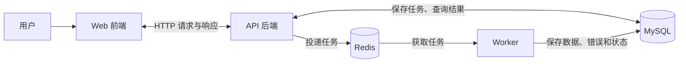

# SyncFlow 整体系统讲解

本文用于帮助理解项目架构、各服务的职责、核心处理流程，以及当前骨架已经实现的内容。

根据 Week 1 的 AI 使用要求，你不仅要把项目跑起来，还要能解释各部分为什么存在、怎么配合，以及如何验证它们能够运行。建议先理解整体系统，再逐个阅读代码和配置文件。

## 1. 这个项目解决什么问题？

假设运营人员有一份包含 1,000 条商品数据的 CSV，需要导入系统。

普通脚本可能只告诉你“运行结束”或者“报错了”。SyncFlow 要让整个过程可以追踪：

- 每次导入都有一个任务编号。
- 可以知道任务正在等待、处理中，还是已经结束。
- 可以看到成功多少条、失败多少条。
- 可以查到具体的失败原因。

用户随后提供了商品名称样例，表头为 `external_id,name,amount,record_date`。示例字段已知，完整字段限制和业务含义仍待确认，不能仅凭样例确定数据库约束。详见 [CSV 示例与字段说明](csv-format.md)。

## 2. 为什么有五个服务？

这张图描述产品预期的业务架构，不代表当前骨架已经实现完整链路。

| 服务 | 负责什么 | 本项目使用什么 |
| --- | --- | --- |
| Web | 用户操作界面：上传文件、查看任务和结果 | React + TypeScript |
| API | 接收网页请求，创建任务，提供查询接口 | Python + FastAPI |
| MySQL | 持久保存任务、业务数据、错误记录等 | MySQL 8 |
| Redis | 在 API 和 Worker 之间传递待处理任务 | Redis 7 |
| Worker | 在后台实际处理 CSV | 独立 Python 进程 |

API 和 Worker 虽然都用 Python，但它们是两个独立运行的进程。API 负责及时回应用户，Worker 负责处理耗时工作。

## 3. 一次导入是怎么完成的？

### 第一步：Web 把文件提交给 API

用户在浏览器里选择 CSV 文件，网页通过 HTTP 请求把文件发送给 API。

### 第二步：API 校验请求、保存任务并安排后台处理

任务记录保存在 MySQL，待处理任务通过 Redis 交给 Worker。创建成功后，API 快速返回任务编号。

具体返回与队列投递的时序、失败时的处理方式，还需要后续技术设计明确。

### 第三步：Worker 获取任务并处理 CSV

Worker 逐行检查数据，把合法记录写入 MySQL，保存错误记录，并更新处理统计和任务状态。

### 第四步：Web 通过 API 查询任务结果

API 从 MySQL 读取任务信息，返回给网页展示。

需要记住：网页不直接连接 MySQL，也不直接给 Worker 下命令。用户查看结果时，也不是直接从 Redis 读取结果。

## 4. 为什么不让 API 直接处理完整个文件？

技术上可以，但本项目要求创建任务快速返回。

如果处理文件需要两分钟，而 API 一直等处理结束才回应：

- 用户会一直等待，不知道是否提交成功。
- 请求可能超时。
- 用户可能重复点击提交。
- 上传请求和耗时处理紧紧绑在一起，不方便管理任务。

异步处理把这两件事拆开：

> 创建请求回答“任务已经受理”；后台处理最终回答“任务处理结果是什么”。

异步不等于处理一定更快，而是用户请求不必一直等待处理完成。

## 5. MySQL 和 Redis 为什么都需要？

它们在这里承担不同职责：

- **MySQL 保存需要长期查询的事实**：有哪些任务、状态是什么、写入了哪些数据、哪些记录出错。
- **Redis 负责待处理任务的传递**：让 API 和 Worker 可以独立工作。

可以把 Redis 理解成“待办任务队列”，把 MySQL 理解成“任务档案和数据存储”。

但队列本身不会自动保证任务绝不丢失、绝不重复。投递失败怎么办、重复执行怎么办，是后续需要设计的可靠性问题。

## 6. Docker 和 Docker Compose 做什么？

### Docker：提供各服务的运行环境

MySQL 在自己的容器里运行，API 在带有 Python 和依赖的容器里运行。各个服务的环境由镜像和配置描述。

### Docker Compose：统一组织五个服务

Compose 把五个服务的启动方式写在一起，包括：

- 使用哪个镜像，或者如何构建镜像。
- 向服务传入哪些环境变量。
- 开放哪些端口。
- 数据保存在哪里。
- 哪些服务需要先准备好。

因此，可以使用一个启动脚本拉起整套系统。

### 本机访问入口

| 地址或端口 | 用途 |
| --- | --- |
| `localhost:5173` | 打开前端页面 |
| `localhost:8000` | 访问 API |
| `localhost:3306` | 本机连接 MySQL |
| `localhost:6379` | 本机连接 Redis |

### 容器内部的地址

容器里的 `localhost` 指向容器自己。

因此，API 容器连接 MySQL 时应使用 `mysql:3306`；前端服务代理到 API 时使用 `api:8000`。这些名称来自 Compose 的服务名。

浏览器仍通过本机的 `localhost:5173` 访问前端。前端开发服务收到 `/api` 请求后，再通过容器内部地址转发给 API。

### 数据保存

MySQL 数据存放在 Docker 数据卷里，因此普通停止容器不会删除数据库。删除数据卷则会删除其中的数据库数据。

## 7. 当前实际完成了什么？

截至 Week 1 前六项交付，当前实现情况如下。

| 已经实现并验证 | 后续才实现 |
| --- | --- |
| React 首页能够访问 | CSV 上传 |
| FastAPI 服务信息接口能够响应 | 创建和查询真实任务 |
| 前端服务能够把请求代理给 API | Redis 任务投递与消费 |
| MySQL、Redis 能运行，开发数据库已创建 | CSV 校验、业务数据写入 |
| Worker 能启动并正常停止 | 完整任务状态、错误记录、重试等 |

当前 Worker 还没有连接队列处理任务，API 也还没有读写业务数据库。数据库查询成功证明数据库环境可用，不能据此说完整导入链路已经跑通。

第六项 `/healthz` 已实现，返回 HTTP 200 和 `{"status":"ok"}`。Docker 使用它检查 API 是否能响应；该接口不检查 MySQL 或 Redis，不代表业务链路全部正常。`/readyz` 尚未实现。

## 8. 项目文件分别负责什么？

| 文件 | 需要能解释的内容 |
| --- | --- |
| [compose.yaml](../../compose.yaml) | 五个服务如何启动、连接、映射端口和保存数据 |
| [.env.example](../../.env.example) | 配置项是什么意思，哪些目前只是预留 |
| [main.py](../../backend/app/main.py) | FastAPI 应用如何创建，一个请求如何得到响应 |
| [worker.py](../../backend/app/worker.py) | 后台进程如何保持运行、接收停止信号 |
| [main.tsx](../../frontend/src/main.tsx) | React 页面如何显示，路由如何匹配 |
| [vite.config.ts](../../frontend/vite.config.ts) | 前端开发服务如何把 `/api` 请求转发给后端 |
| [start.sh](../../scripts/start.sh) | 如何准备配置并统一启动服务 |

建议从 `compose.yaml` 开始逐段阅读，它能把五个服务串起来，再继续看 API、Worker 和前端入口文件。

## 9. 如何满足 AI 使用要求？

AI 已执行的检查可以作为参考，但你仍需要亲手运行验证，并理解结果代表什么。

- 按照 [README](../../README.md) 运行启动命令。
- 打开前端页面和 API，确认对应端口可以访问。
- 查询开发数据库，确认连接成功且数据库存在。
- 检查 Redis 的 PING 响应。
- 查看服务状态和日志，理解哪里体现启动成功、哪里体现错误。
- 阅读生成的代码与配置，能够解释每一部分的作用。

运行环境验证通过，只能说明已经检查的部分正常。后续 CSV、状态机和重试等业务功能，需要各自的测试与验证。

## 参考文档

- [产品需求说明书](../sources/product-requirements.pdf)
- [Week 1 任务文档](../sources/week-01.pdf)
- [需求理解](requirements-understanding.md)
- [用户角色与核心流程](roles-and-core-flow.md)
- [前五项交付与验证记录](../delivery/week-01-first-five.md)
