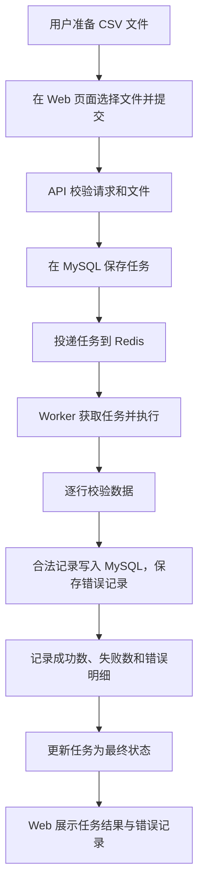

# SyncFlow 用户角色与核心流程

本文依据 [产品需求说明书](product-requirements.pdf) 第 2、3、5、6 节，整理用户角色和核心业务流程，作为 Week 1 的需求理解产出。本文描述产品预期行为，不表示这些业务功能已经实现。

## 1. 用户角色

### 1.1 数据操作人员

负责将 CSV 文件中的业务数据批量导入系统，并检查导入结果。

| 主要操作 | 希望获得的结果 |
| --- | --- |
| 选择并上传 CSV 文件，创建同步任务 | 获得任务编号，便于后续查询 |
| 查看任务列表和任务详情 | 了解任务当前状态和处理进度 |
| 查看处理统计 | 了解总行数、成功数和失败数 |
| 查看错误明细 | 知道哪些记录失败以及失败原因，便于排查和修正数据 |

### 1.2 系统维护人员

负责定位运行问题，维护本地环境，保障任务处理服务可用。

| 主要操作 | 希望获得的结果 |
| --- | --- |
| 查看运行日志和失败任务 | 根据任务 ID 追踪问题并定位失败原因 |
| 查看执行尝试和重试情况 | 了解任务是否正在重试，以及最终执行结果 |
| 按产品支持的方式重试任务 | 处理暂时性故障带来的失败，具体操作规则待后续文档明确 |
| 维护本地运行环境和升级服务 | 确保 Web、API、Worker、MySQL 和 Redis 正常运行 |

### 1.3 角色边界

- 两类角色用于描述使用场景，不代表需要实现两套账号或后台。
- 本项目不实现登录和权限控制，所有功能对所有访问者开放。
- 重试属于产品使用场景，可配置重试策略与执行记录列在 V1.1 增强方向；具体版本实现边界仍需结合后续任务文档确认。

## 2. 核心业务流程

### 2.1 流程概览

这张图概括 PRD 中的正常主流程。创建任务的请求应快速返回任务编号，不能等待整个 CSV 处理结束；用户随后通过查询获取状态和结果。响应与队列投递的精确时序、投递失败的处理方式由后续技术设计明确。

### 2.2 各步骤的职责

| 步骤 | 执行方 | 主要工作 |
| --- | --- | --- |
| 1. 准备与提交文件 | 数据操作人员、Web | 选择 CSV 文件，向 API 提交创建任务请求 |
| 2. 校验请求和文件 | API | 校验请求与文件，避免无效输入进入后续流程；详细规则和校验阶段以任务文档为准 |
| 3. 保存任务 | API、MySQL | 保存可追踪的任务记录，供后续执行与查询 |
| 4. 投递任务 | API、Redis | 将任务交给异步处理链路 |
| 5. 获取并处理任务 | Worker | 获取待处理任务，读取 CSV 并逐行校验 |
| 6. 保存处理结果 | Worker、MySQL | 写入合法业务记录，保存错误记录并更新处理统计 |
| 7. 更新最终状态 | Worker、MySQL | 根据处理结果更新任务状态，具体判定遵循后续状态机设计 |
| 8. 查询与展示 | Web、API、MySQL | 展示任务列表、任务详情、统计和错误明细，列表类查询支持分页 |

## 3. 异常情况的需求边界

| 情况 | 已明确的要求 | 尚需明确的规则 |
| --- | --- | --- |
| 空文件、表头错误等文件问题 | 系统需要识别并正确处理 | 是否创建任务、返回什么错误码，以及在哪个阶段校验 |
| 单行字段错误 | 校验记录，保存可查询的错误信息；合法记录需要可靠写入 | 精确字段规则、最终状态和统计口径 |
| 同一任务内业务标识重复 | 不得重复写入，数据库需要相应唯一约束 | 保留首条、报错范围等处理细则 |
| 数据库或队列暂时不可用 | 任务状态可追踪，错误可定位；产品需要考虑重试与恢复 | 投递失败补偿、事务边界、重试条件和版本实现范围 |

以上未明确项保留为待确认，不在本需求整理中自行规定。完整疑问清单见 [需求理解文档](requirements-understanding.md)。

## 4. Week 1 对应产出

本周需要能说明两类用户分别要做什么，以及一次导入如何经过 Web、API、Redis、Worker 和 MySQL 完成。本文件用于角色和核心流程整理；完整异常分支图、接口契约、数据库设计与任务状态机仍需在后续设计任务中完善。
